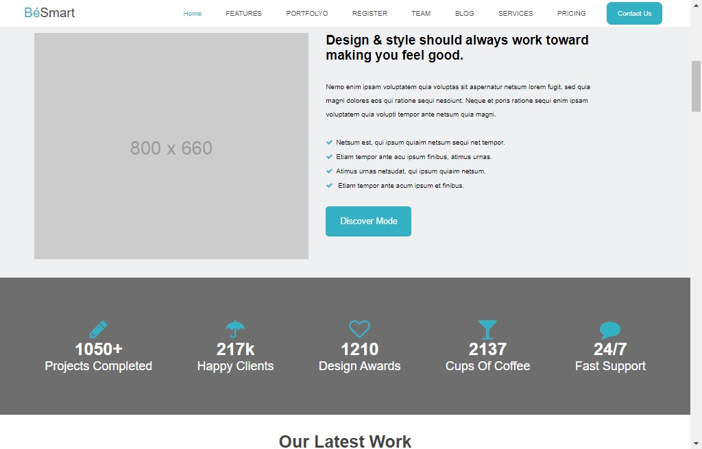
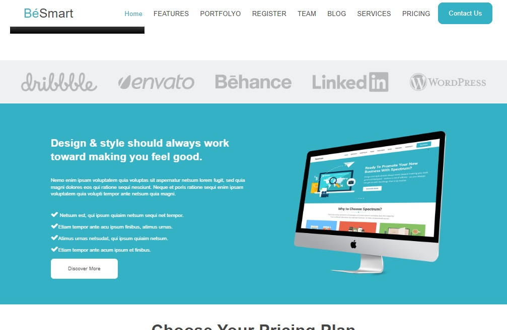
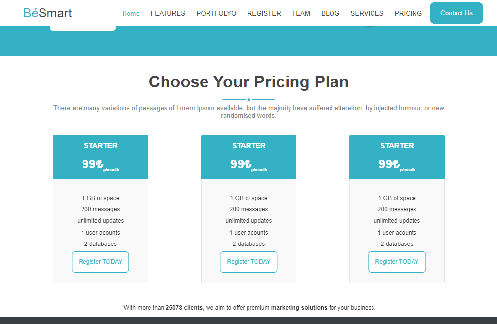

# BeSsmart Klonu
###### Aldığım bir canlı eğitim sonunda bitirme projesi mahiyetinde ödev olarak verilen bir sayfa şablonunu elimden geldiğince klonlamaya çalıştım 

## Görseller

    

        
        
        
        
    

